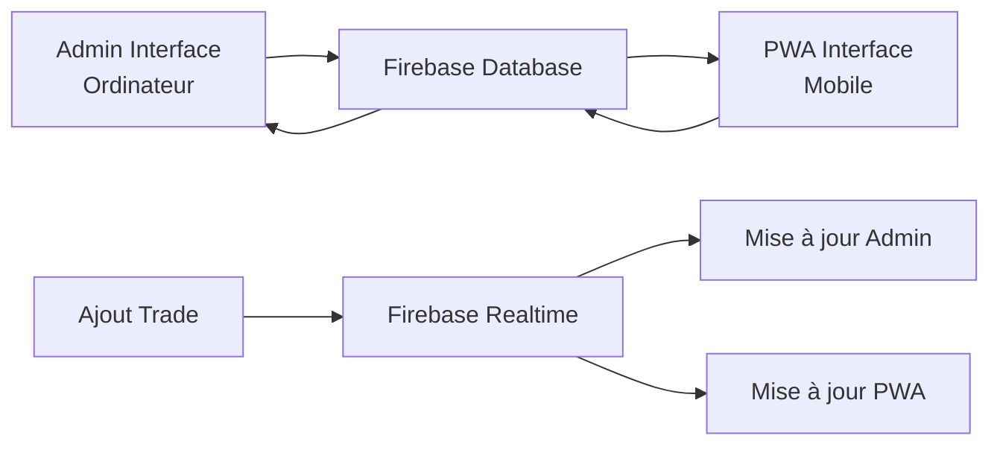

# CHECKPOINT - Synchronisation Temps Réel Trades Personnels

**Date**: 2025-01-28  
**Commit**: `47f8114` - "CHECKPOINT: Synchronisation temps réel trades personnels - Admin ↔ PWA automatique via Firebase"

---

## 🎯 Objectif Atteint

✅ **Synchronisation automatique trades personnels** entre interface admin (ordinateur) et PWA (mobile)

### Problème Résolu
- Avant : Trades ajoutés sur ordinateur n'apparaissaient pas sur PWA
- Maintenant : Synchronisation temps réel instantanée via Firebase

---

## 🛠️ Modifications Techniques

### 1. Firebase Setup (`src/utils/firebase-setup.ts`)
```typescript
// NOUVELLE FONCTION
export const listenToPersonalTrades = (
  onTradesUpdate: (trades: PersonalTrade[]) => void,
  onError?: (error: Error) => void
): (() => void) => {
  // Écoute temps réel Firebase Database
  // Mise à jour automatique des trades
  // Nettoyage automatique des listeners
}
```

### 2. AdminInterface (`src/components/AdminInterface.tsx`)
- ✅ Import `listenToPersonalTrades`
- ✅ Remplacement chargement manuel par synchronisation temps réel
- ✅ useEffect avec cleanup automatique
- ✅ Logs détaillés pour debug

### 3. TradingPlatformShell (`src/components/generated/TradingPlatformShell.tsx`)
- ✅ Import `listenToPersonalTrades`
- ✅ Remplacement chargement manuel par synchronisation temps réel
- ✅ useEffect avec cleanup automatique
- ✅ Logs détaillés pour debug

---

## 🔄 Flux de Synchronisation



### Étapes de Synchronisation
1. **Trade ajouté** → Firebase Database
2. **Firebase notifie** → Tous les listeners
3. **AdminInterface** → Mise à jour automatique
4. **TradingPlatformShell** → Mise à jour automatique
5. **Synchronisation complète** → < 1 seconde

---

## 📊 Fonctionnalités Actives

### ✅ Synchronisation Bidirectionnelle
- Admin → PWA : Trades ajoutés sur ordinateur apparaissent sur mobile
- PWA → Admin : Trades ajoutés sur mobile apparaissent sur ordinateur

### ✅ Temps Réel
- Mise à jour instantanée (< 1 seconde)
- Pas besoin de recharger la page
- Pas besoin de cliquer sur "Recharger"

### ✅ Gestion des Erreurs
- Logs détaillés pour debug
- Gestion gracieuse des erreurs de connexion
- Cleanup automatique des listeners

### ✅ Performance Optimisée
- Écoute uniquement sur les trades personnels
- Tri automatique par date
- Nettoyage mémoire automatique

---

## 🧪 Tests de Validation

### Scénario 1: Admin → PWA
1. Ouvrir interface admin sur ordinateur
2. Ouvrir PWA sur mobile
3. Ajouter un trade sur admin
4. ✅ Trade apparaît instantanément sur PWA

### Scénario 2: PWA → Admin
1. Ouvrir PWA sur mobile
2. Ouvrir interface admin sur ordinateur
3. Ajouter un trade sur PWA
4. ✅ Trade apparaît instantanément sur admin

### Scénario 3: Modifications
1. Modifier un trade existant
2. ✅ Changements synchronisés automatiquement
3. ✅ Suppression synchronisée automatiquement

---

## 📝 Logs de Debug

### AdminInterface
```
👂 Démarrage synchronisation temps réel trades [ADMIN]...
✅ Écoute temps réel trades démarrée
🔄 Mise à jour trades reçue [ADMIN]: 5
```

### TradingPlatformShell (PWA)
```
👂 Démarrage synchronisation temps réel trades [PWA]...
✅ Écoute temps réel trades démarrée
🔄 Mise à jour trades reçue [PWA]: 5
```

---

## 🎯 Impact Utilisateur

### Avant
- ❌ Trades ajoutés sur ordinateur n'apparaissaient pas sur mobile
- ❌ Fallait recharger manuellement
- ❌ Synchronisation manuelle nécessaire

### Maintenant
- ✅ Synchronisation automatique instantanée
- ✅ Expérience utilisateur fluide
- ✅ Données toujours à jour
- ✅ Pas d'action manuelle requise

---

## 🔮 Prochaines Étapes Possibles

- [ ] Synchronisation des signaux en temps réel
- [ ] Notifications push pour nouveaux trades
- [ ] Historique des modifications
- [ ] Conflits de synchronisation
- [ ] Mode hors ligne avec sync

---

**Status**: ✅ **FONCTIONNALITÉ COMPLÈTE ET OPÉRATIONNELLE**

**Test**: Ajouter un trade sur une interface → Vérifier apparition automatique sur l'autre interface

**Performance**: < 1 seconde de latence de synchronisation
